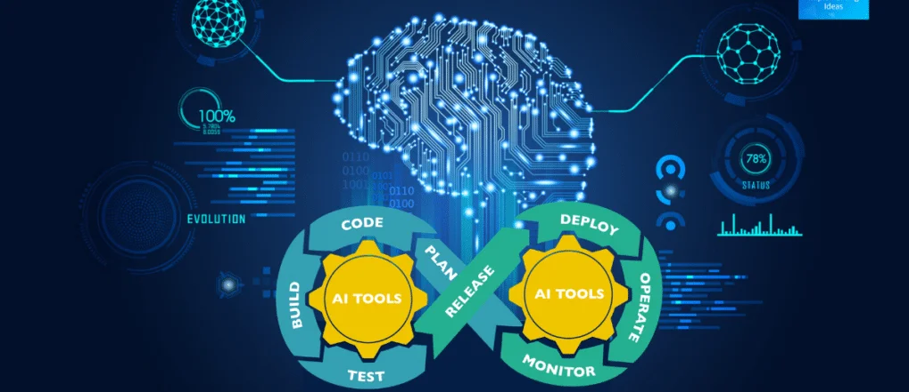

# Machine Learning for DevOps Training

The integration of Machine Learning (ML) into DevOps is revolutionizing the field by addressing key challenges such as scalability, data overload, and incident prediction. ML enhances DevOps practices through predictive analytics, anomaly detection, automated root cause analysis, resource optimization, and automated testing. This synergy enables proactive identification and resolution of issues, optimal resource utilization, and continuous improvement of CI/CD pipelines. Companies like Netflix, Uber, and Spotify are already leveraging ML to optimize their operations, demonstrating its transformative potential. Embracing ML in DevOps not only enhances efficiency and reliability but also positions organizations to stay competitive in a rapidly evolving technological landscape.

**Bassem Ben Hamed**

